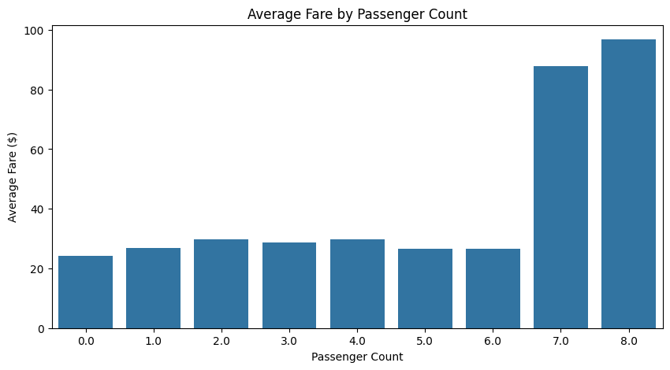

# 🚖 NYC Taxi Data Analysis

**Domain:** Transportation  
**Function:** Data Analytics  

## Project Overview  
This project analyzes NYC taxi trip data to uncover insights into **passenger behavior, trip patterns, and fare dynamics**.  
We use **PySpark** for distributed data processing, **SQL queries** for structured analysis, and **Python visualization libraries** to generate insights that optimize taxi operations and improve customer experience.

---

## Problem Statement  
The objective is to analyze NYC taxi trip data to:  
- Identify patterns in **passenger behavior, trip durations, and fare pricing**.  
- Detect **peak demand hours** to aid in resource allocation and pricing optimization.  
- Uncover **fare inefficiencies** and suggest improvements for cost-effective travel.  

---

## Tech Stack & Tools  
- **PySpark**: Distributed data processing & SQL queries  
- **Python Libraries**:  
  - `pandas` - Data manipulation  
  - `matplotlib`, `seaborn` - Data visualization  
- **Jupyter Notebook**: Interactive execution & documentation  

---

## Key Features  
- **Dynamic SQL Queries**: Extract meaningful insights on passenger trends and pricing.  
- **Feature Engineering**: Created `pickup_hour`, `trip_duration`, and `fare_per_mile` for deeper analysis.  
- **Interactive Visualizations**: Used Matplotlib and Seaborn for charts and trend analyses.  
- **Scalability**: PySpark ensures efficient processing of large datasets.  

---

## 1. Data Processing Steps  
- Loaded and cleaned the NYC taxi dataset, handling missing values and filtering out invalid entries (e.g., zero or negative fares and trip distances).
- Converted datetime columns (tpep_pickup_datetime and tpep_dropoff_datetime) into timestamp format for easier manipulation and analysis. 

## 2️. Feature Engineering  
- Extracted the hour of the day from pickup timestamps to analyze hourly trends in trips and fares.
- Calculated trip duration in minutes to understand how long trips typically last.
- Created a new feature, trip_duration and fare_per_mile, to measure the cost efficiency of trips and identify anomalies or trends in pricing.
  

  
## 3️. SQL-Based Analysis  
Analyzed average fares by passenger count to understand how group size impacts pricing.
Examined total trips by pickup hour to identify peak demand periods during the day.
Investigated average trip durations by passenger count to uncover patterns in ride lengths based on group size.
Explored average fare per mile by pickup hour to assess pricing trends at different times of the day.

## 4️. Data Visualization  
- Created bar plots, line charts, and other visualizations to interpret SQL query results effectively.
- Visualized key metrics such as average fares by passenger count, and total trips by peak hour trends to provide clear insights into taxi operations.

---

## Actionable Insights  
- Identified peak hours for taxi demand, enabling better resource allocation and dynamic pricing strategies.
- Highlighted inefficiencies in fare-per-mile calculations, suggesting opportunities to optimize pricing models.
- Provided insights into passenger behavior, helping tailor marketing campaigns and improve customer satisfaction.

---

## Future Enhancements  
- **Geospatial Analysis**: Utilize GPS coordinates to analyze popular routes and high-demand locations.  
- **Machine Learning**: Develop predictive models to forecast taxi demand based on historical data and external factors.  
- **Interactive Dashboard**: Build a dashboard using **Power BI** or **Tableau** for real-time insights.  

---

